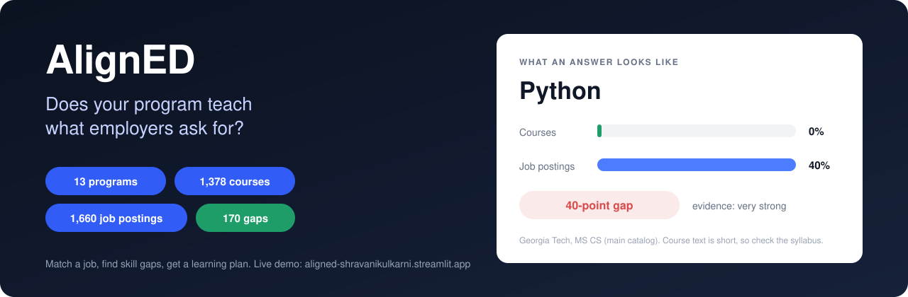
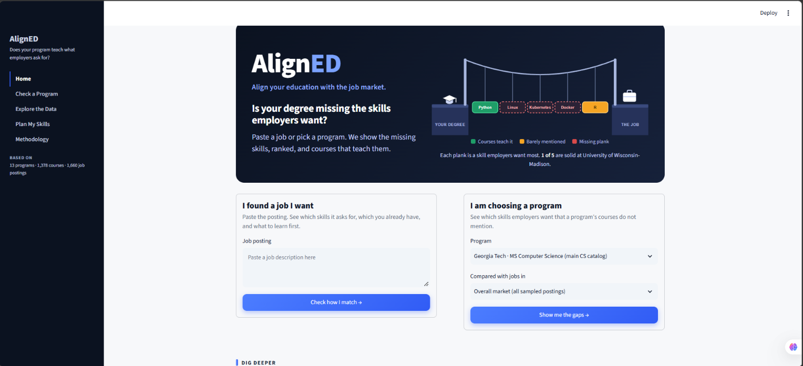
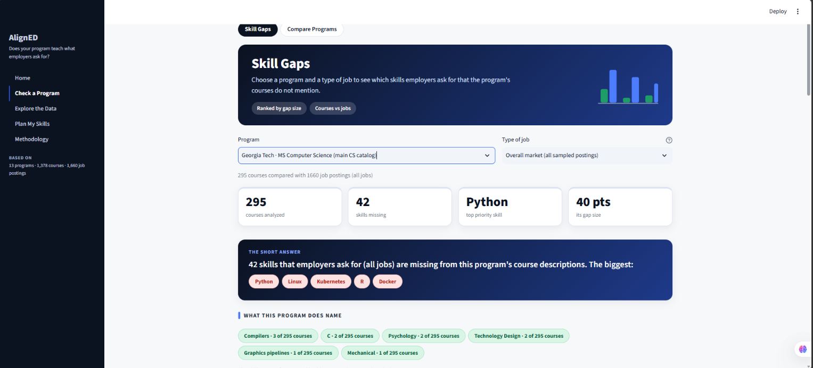
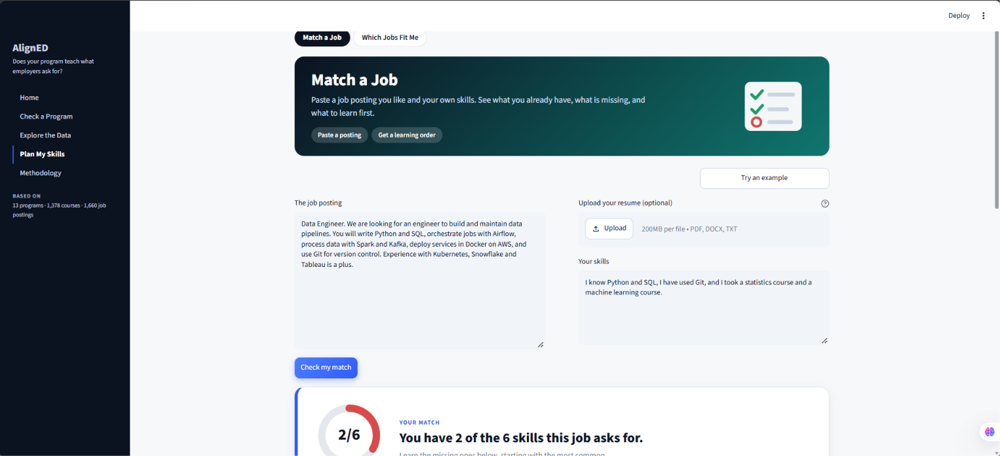
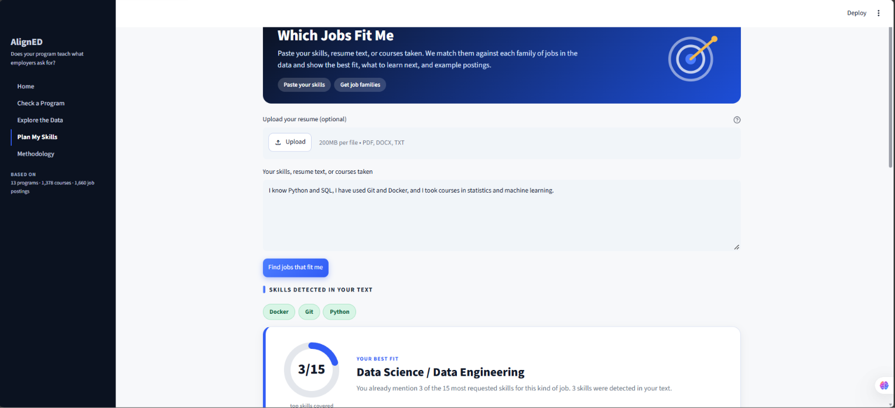
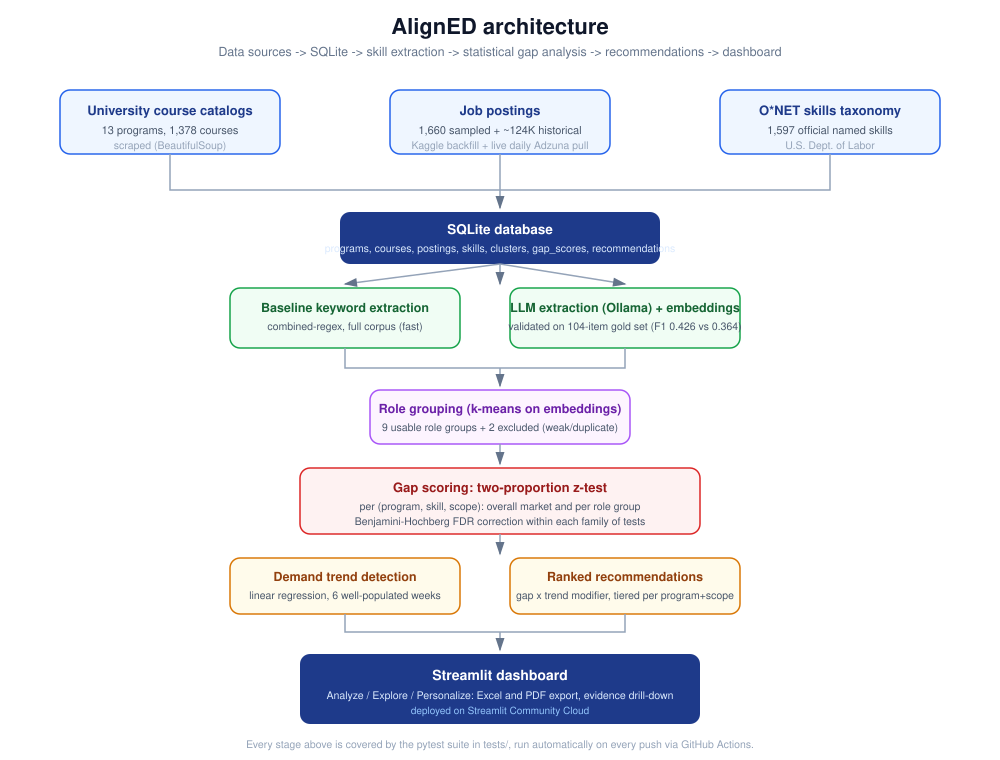
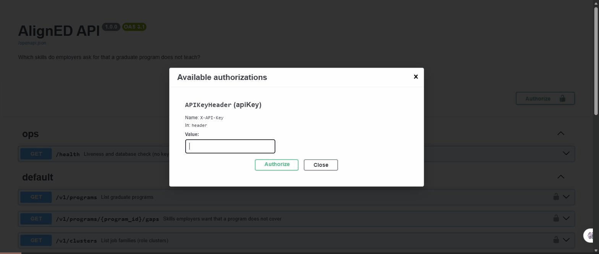

<p align="center"></p>

# AlignED

[](https://github.com/shravanii15/AlignED/actions/workflows/run_tests.yml)
[](https://github.com/shravanii15/AlignED/actions/workflows/fetch_adzuna.yml)
[](LICENSE)

**Do graduate computing programs teach what the job market asks for?**

AlignED compares 1,378 course descriptions from 13 graduate programs against 1,660 sampled job postings. Skills are mapped to the O\*NET taxonomy, and each gap is tested for statistical significance.

**[Live dashboard](https://aligned-shravanikulkarni.streamlit.app)**

## What I found

- **170 significant skill gaps** across the 13 programs (two-proportion z-test, or Fisher's exact test for small counts, with Benjamini-Hochberg FDR correction).
- **Hands-on tools are the consistent gap.** Python, Docker, Kubernetes, Linux, Git and Tableau are under-covered in most programs, often by 10 to 40 percentage points.
- **No demand trend survived correction.** 9 of 67 skills looked significant on a raw p-value and 0 held up after FDR correction, so the trends page labels them early hints.
- **The keyword baseline beat the LLM on a fresh test.** On the 104 items used while the methods were built, the LLM scored higher (F1 0.426 vs. 0.364). On 50 new items labeled before either method ran, the order reversed: keyword baseline F1 0.311 (95% interval 0.234 to 0.377) against LLM 0.198 (0.125 to 0.270). The 95% interval for the difference, -0.177 to -0.046, excludes zero. The full-scale pipeline uses the keyword method, which this result supports. See Limitations for the caveats.

## Screenshots

| Home | Skill Gaps |
|---|---|
|  |  |
| **Match a Job** | **Which Jobs Fit Me** |
|  |  |

## Key results

| Metric | Result |
|---|---|
| Programs / courses | 13 programs, 1,378 courses |
| Job postings used for gap scoring | 1,660 (category-balanced sample) |
| Significant skill gaps | 170 in the overall-market scope |
| Recommendations | 69 overall-market, 724 across all program and job-family scopes |
| Skill extraction benchmark | Held-out, 50 new items: keyword F1 0.311 vs. LLM 0.198. Development set, 104 items: LLM 0.426 vs. keyword 0.364 |
| Skills with a confirmed demand trend | 0 of 67 after FDR correction |

## How it works



Scrape course catalogs, extract skills, normalize them to O\*NET, compare each program's coverage with market demand, test for significance, and rank recommendations. Results are stored in SQLite and served by a Streamlit dashboard.

## Dashboard

Built around two questions: "does this program teach what employers want?" and "what should I learn?"

- **Home:** two starting points, one for a job you found and one for choosing a program.
- **Match a Job:** paste a job posting, or upload a resume (PDF, DOCX, TXT), to see what you have, what is missing and what to learn first. Includes a downloadable PDF plan.
- **Skill Gaps:** pick a program and a type of job. Top gaps appear as cards with a "How we know" panel, a chart of the skills employers ask for most, and Excel and PDF downloads. The Excel file has a filterable skills table and a heatmap across all 13 programs.
- **Which Jobs Fit Me:** paste your skills to see which job families fit you, what to learn next and example postings, with a PDF.
- **Compare Programs:** top gaps for 2 to 3 programs side by side.
- **Explore the Data:** skills by program, rising and falling skills, job families from embedding-based clustering, and a course search.
- **Methodology:** how the numbers are produced, and their limits.

## Data engineering

- **Daily ingestion** (`scripts/ingest_adzuna.py`, run by GitHub Actions). Fetches Adzuna postings with retries and exponential backoff, saves the untouched response as a dated raw snapshot (`data/raw/adzuna/`), then validates, deduplicates and loads into SQLite.
  - Validation rejects postings with no id, no title, a description too short to extract skills from, or an unreadable or future date. Impossible salary ranges are blanked, not rejected.
  - Deduplication skips a repeated id and also a repost under a new id, using a content fingerprint of title, company and description.
  - Every run is recorded in `ingest_runs`, and every rejected posting in `rejected_postings` with its reason. A run is marked degraded when more than 30% of postings are rejected, and the scheduled job then fails, which is the alert.
  - Loading is idempotent: replaying a snapshot inserts nothing new. Raw snapshots are committed, so the postings can always be rebuilt from them.
  - Loaded Adzuna postings never change a dashboard number. Gap scores and trends use only the Kaggle historical sample.
- **Orchestration with Prefect** (`scripts/orchestration/flows.py`). A daily flow runs ingest, then the integrity check, then the derived-table rebuild, and publishes a run report. A failed fetch is retried (3 times, 60 s apart) but a data-quality failure is not, since fetching the same bad data again would not fix it. A backfill flow replays every raw snapshot in order and is safe to repeat. Failed runs call an alert hook that posts to a webhook when `ALERT_WEBHOOK_URL` is set. Run it with `python scripts/orchestration/flows.py daily`, or `serve` to run on a schedule.
- **Weekly market refresh** (`scripts/market_pulse.py`, run every Monday by `.github/workflows/weekly_refresh.yml`, or `python scripts/orchestration/flows.py weekly`). Replays the saved daily snapshots, de-duplicates them, finds skills with the keyword method, and compares each skill's share of recent postings with the fixed 1,660-posting sample (same significance test and Benjamini-Hochberg correction as the gaps). The result is one small JSON file, `data/market_pulse/latest.json`, shown on the Rising and Falling Skills page with a "last updated" date. It deliberately does not change gap scores, recommendations or trends, so published numbers never move silently. The feed returns only the first 500 characters of each description, so the fixed sample is re-measured on the same 500-character window to keep the comparison like-for-like.
- **dbt models with data tests** (`dbt/`). The analytics layer is modelled in dbt (DuckDB): staging views over the exported tables, then three marts (`fct_program_skill_gaps`, `dim_program_summary`, `fct_skill_market_coverage`). 50 checks run on every build: keys unique and not null, foreign keys resolve, accepted values, plus rules written for this project (every gap has q < 0.05, gap equals demand minus coverage, rates are proportions, no program or scope with gaps is left without recommendations). Run it with `python dbt/export_sources.py && dbt build --project-dir dbt --profiles-dir dbt`; CI runs it too.
- **Held-out evaluation** (`data/heldout/`, protocol in `PROTOCOL.md`). A fresh sample of 50 items (30 courses, 20 postings), none from the development set, labeled before the methods ran (AI-drafted, then checked by a human, enforced by the importer) and scored once with settings frozen. Paired-bootstrap 95% intervals are reported for each F1 and for the difference, and hashes of the extractor code and labels are stored in `heldout_results.json`. Result: keyword baseline 0.311 vs. LLM 0.198 (see Key results). By source: on postings the LLM was more precise (0.78 vs. 0.66) but found fewer skills (recall 0.16 vs. 0.24); on courses it found almost none (recall 0.03).
- **Rebuild and validation.** `scripts/rebuild_all.py` recomputes the derived tables on a temporary copy, runs `scripts/validate_database.py` (foreign keys, duplicates, gap and recommendation invariants, trend consistency, ingestion audit) and swaps the result in atomically.
- **Fail-closed evaluation.** The extraction benchmark refuses to publish metrics unless predictions cover exactly the gold-set items.
- **Schema.** `database/schema.sql` is the source of truth, with enforced foreign keys and additive migrations.
- **Docker.** One Dockerfile with two targets (dashboard and pipeline) and a compose file. Pipeline jobs are opt-in.
- **CI.** On every push: lint (ruff), the full pytest suite on lightweight requirements, then both Docker images build and the dashboard container must report healthy.

**Stack:** Python, SQLite, Streamlit, Plotly, pandas, scipy, scikit-learn, sentence-transformers, Ollama, BeautifulSoup, Docker, GitHub Actions

## REST API



The same analysis is available over HTTP (`api/`, FastAPI). It is read-only, versioned under `/v1`, and protected by an API key.

```bash
export ALIGNED_API_KEYS=choose-a-long-random-key      # PowerShell: $env:ALIGNED_API_KEYS="..."
uvicorn api.main:app                                   # or: docker compose up api
# interactive docs: http://127.0.0.1:8000/docs
```

| Endpoint | What it returns |
|---|---|
| `GET /health` | Liveness and database check (no key needed) |
| `GET /v1/programs` | Programs, with `university` filter and `limit`/`offset` paging |
| `GET /v1/programs/{id}/gaps` | Significant skill gaps for a program, ranked by priority, with q-values and rationale; filter by `cluster_id` or `tier` |
| `GET /v1/clusters` | Job families |
| `POST /v1/match` | Send a job posting and your skills, get what you have and what is missing, most in-demand first |

```bash
curl -H "X-API-Key: $ALIGNED_API_KEYS" "http://127.0.0.1:8000/v1/programs/38/gaps?limit=3"
curl -X POST -H "X-API-Key: $ALIGNED_API_KEYS" -H "Content-Type: application/json" \
  -d '{"job_text": "Data Engineer. Python, SQL, Docker and Git daily.", "my_skills": "I know Python"}' \
  http://127.0.0.1:8000/v1/match
```

Security and operations: keys are compared in constant time and the API refuses every protected call if no key is configured; requests are rate limited per key (default 60 per minute, `429` with `Retry-After`); inputs are validated and capped; SQL is always parameterised; the database is opened read-only; every response carries an `X-Request-ID` and each request is logged as one JSON line.

## Run it

```bash
git clone https://github.com/shravanii15/AlignED.git
cd AlignED/dashboard
pip install -r requirements.txt
streamlit run app.py
```

With Docker:

```bash
docker compose up dashboard                              # dashboard at http://localhost:8501
docker compose --profile pipeline run --rm ingest        # fetch, validate, load postings (needs .env)
docker compose --profile pipeline run --rm rebuild       # recompute gap scores and recommendations
```

Tests: `pip install -r requirements-test.txt`, then `python -m pytest tests/`.

## Reproducing the database

The committed `database/aligned.db` is a snapshot. What can be reproduced depends on the inputs:

- **From the repository alone:** `python scripts/rebuild_all.py` recomputes the derived tables (gap scores and recommendations) from the raw tables in the snapshot. It works on a temporary copy, validates it, and replaces the real database only if every check passes.
- **From raw sources:** `python scripts/rebuild_all.py --full` runs every stage in order and checks each stage's inputs first. Committed inputs: the scraped course catalogs (`data/sample_*_courses.json`), the O\*NET vocabulary (`data/taxonomy/`), the 1,660-posting clustering sample (`data/clustering/`) and the raw Adzuna snapshots (`data/raw/adzuna/`). Not committed, because of size or credentials: the 530 MB Kaggle postings CSV (needs Kaggle credentials), the O\*NET and Adzuna API keys (copy `.env.example` to `.env`), and a local Ollama model for the LLM benchmark.

Stage order: `setup_database.py`, `gap_analysis/build_lookup_tables.py`, `extract_course_skills.py`, `extract_posting_skills.py`, `extract_posting_trends.py`, `compute_skill_trends.py`, `compute_gap_scores.py`, `generate_recommendations.py`. `setup_database.py` builds a new database file, replays every raw Adzuna snapshot through the validating loader, and swaps the result in only when complete.

The 170 gaps in the results table are the overall-market scope. The database holds 1,040 gap rows in total, because each program is also compared against each job family separately.

## Limitations

- **Coverage is a text signal.** "Covered" means a skill name appears in a course description, not that it is taught in depth. "Demand" means it appears in the sampled postings.
- **The posting sample is category-balanced**, not proportional to the real labor market, so demand figures describe this sample only.
- **Corpus sizes differ by program**, which affects coverage rates.
- **Read the benchmark with care.** The 0.426 vs. 0.364 result is on the development set, which the methods were tuned on, so it is optimistic. The held-out result (keyword 0.311, LLM 0.198) is the more trustworthy one, but it has limits: 50 items give wide intervals; the labels were drafted by an AI and checked by one human (no second annotator, and a reviewer can anchor on a draft); the development labels also included lower-priority "optional" skills while the held-out labels did not; and the O*NET skill list has no entry for subjects such as machine learning or statistics, so both methods have low recall (about 0.2 and 0.1). The reversal could come from the similarity threshold having been tuned on the development set, from the different labeling style, or from chance, and this data cannot tell which. The matching step tries exact, alias and spelling-variant matches first and blocks known confusions (SQL with MySQL, for example).
- **The dashboard reads a snapshot.** The daily job now loads new postings into SQLite with validation and deduplication, but the committed database is updated only when a snapshot is replayed into it, and the live postings are not part of gap scoring or trends (the weekly market pulse compares them with the fixed sample in a separate section). Content-based deduplication also treats one posting listed in several cities as a single posting, which is right for measuring skill demand and wrong for counting openings.
- **Trend detection** uses about 124,000 historical postings, restricted to the weeks with enough volume (68% were dated to a single week by a collection artifact), and no trend is confirmed after correction.

More detail is on the dashboard's Methodology page.

## Repository layout

```
scripts/      collection, ingestion, extraction, gap analysis
dashboard/    Streamlit app
dbt/          dbt models and data tests
api/          REST API (FastAPI)
database/     schema and committed SQLite snapshot
data/         course catalogs, taxonomy, raw Adzuna snapshots, 104-item gold set
tests/        pytest suite
Dockerfile, docker-compose.yml, requirements-*.txt
```

## What I would build next

A larger skill vocabulary and a second annotator for the held-out set, a hosted Prefect deployment, and raw snapshots stored in object storage.

## Author

Shravani Kulkarni, M.S. Data Science, Analytics and Engineering, Arizona State University (May 2027)  
[GitHub](https://github.com/shravanii15) · [Live dashboard](https://aligned-shravanikulkarni.streamlit.app)
